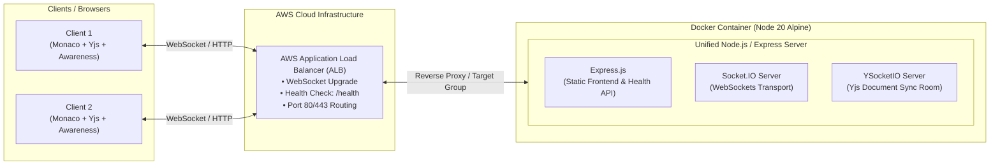

# Collaborative Real-Time Code Editor & Cloud Infrastructure

A production-ready, containerized real-time collaborative code editor powered by **Monaco Editor**, **Yjs (CRDTs)**, **Socket.IO**, and deployed behind an **AWS Application Load Balancer (ALB)** using **Docker multi-stage builds**.

---

## 📌 Architecture Overview



### System Flow
1. **CRDT Synchronization Layer**: The client runs `Yjs` and binds to the Monaco Editor via `y-monaco`. Every keystroke is treated as an operational CRDT update, guaranteeing deterministic conflict-free resolution without locking.
2. **Transport & Awareness**: `y-socket.io` transmits document updates and ephemeral awareness states (username, typing presence, active client list) over WebSockets.
3. **Containerized Server**: Express hosts both the static frontend (built in a multi-stage Docker process) and the Socket.IO + YSocketIO room server.
4. **AWS Ingress**: Traffic routes through an AWS Application Load Balancer (ALB) configured to support WebSocket upgrades, target group health checking (`/health`), and low-latency client routing.

---

## ✨ Features

- **Conflict-Free Real-Time Collaboration**: Concurrent editing powered by Conflict-Free Replicated Data Types (CRDTs) with `Yjs`.
- **VS Code Editing Experience**: Full code editing capabilities via Monaco Editor (`@monaco-editor/react`).
- **Live User Presence & Typing Status**: Real-time connected user roster, dynamic typing indicator with auto-debounced timeout, and clean state disposal on tab close/unload.
- **Unified Multi-Stage Docker Image**: Builds the Vite React frontend in stage 1, packages it into a lightweight Node.js 20 Alpine production container in stage 2.
- **Cloud & Health Monitoring**: Dedicated `/health` endpoint for ALB / ECS target group health checks.
- **Flexible Environment Configuration**: Automatically defaults to relative host (`window.location.origin`) or customizable `VITE_SERVER_URL` for local vs. cloud environments.

---

## 🛠️ Tech Stack

| Domain | Technologies |
| :--- | :--- |
| **Frontend** | React 19, Vite, `@monaco-editor/react`, Tailwind CSS |
| **Real-Time & CRDT** | `yjs`, `y-monaco`, `y-socket.io`, `socket.io-client` |
| **Backend** | Node.js, Express.js (v5), `socket.io`, `y-socket.io` |
| **DevOps & Cloud** | Docker (Multi-stage build), Alpine Linux, AWS Application Load Balancer (ALB) |

---

## 📁 Repository Structure

```text
Doc-Aws/
├── backend/
│   ├── public/              # Production frontend static bundle
│   ├── server.js            # Express server, /health API, and YSocketIO init
│   ├── package.json
│   └── package-lock.json
├── frontend/
│   ├── src/
│   │   ├── app/
│   │   │   ├── App.jsx      # Editor, Yjs provider, presence, and UI
│   │   │   └── App.css
│   │   └── main.jsx
│   ├── index.html
│   ├── vite.config.js
│   └── package.json
├── .dockerignore
├── dockerfile               # Multi-stage production container build
└── README.md
```

---

## 🚀 Getting Started

### 1. Local Development (Without Docker)

#### **Backend Setup**
```bash
cd backend
npm install
npm run dev
# Server runs on http://localhost:3000 (Health check: http://localhost:3000/health)
```

#### **Frontend Setup**
```bash
cd frontend
npm install
npm run dev
# Frontend runs on http://localhost:5173
```
*Note: In development, set `VITE_SERVER_URL=http://localhost:3000` in `frontend/.env`.*

---

### 2. Running with Docker

Build and run the unified container (frontend + backend bundled into a single Alpine image):

```bash
# From the root directory:
docker build -t real-time-editor .

# Run container on port 3000
docker run -d -p 3000:3000 --name doc-editor real-time-editor
```

Open your browser at `http://localhost:3000`.

---

## ⚙️ Environment Variables

### Frontend (`frontend/.env`)
| Variable | Required | Default | Description |
| :--- | :--- | :--- | :--- |
| `VITE_SERVER_URL` | No | `window.location.origin` | Base URL for Socket.IO connection (useful in split local dev) |

---

## 🌐 API & Health Endpoints

- `GET /health`
  - **Status**: `200 OK`
  - **Response**:
    ```json
    {
      "message": "ok",
      "success": true
    }
    ```
  - **Purpose**: Used by AWS Target Groups / Container Orchestrators to verify service availability.

---

## ☁️ AWS Deployment Notes

1. **Target Group Health Checks**: Configure path `/health` on port `3000` with HTTP protocol.
2. **WebSocket Support**: Ensure the Application Load Balancer has idle timeout adjusted (default 60s, recommend 120s+ for long-lived WebSocket sessions) and sticky sessions enabled if running across multiple replica targets.
3. **CORS Configuration**: Restrict allowed origins in `backend/server.js` for production security.
