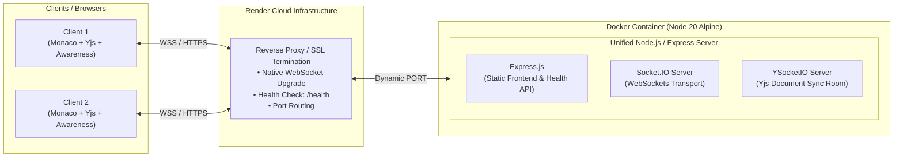

# Collaborative Real-Time Code Editor (Containerized Deployment)

A production-ready, containerized real-time collaborative code editor powered by **Monaco Editor**, **Yjs (CRDTs)**, and **Socket.IO**, deployed using **Docker multi-stage builds** on **Render**.

---

## 📌 Architecture Overview



### System Flow
1. **CRDT Synchronization Layer**: The client runs `Yjs` and binds to the Monaco Editor via `y-monaco`. Every keystroke is treated as an operational CRDT update, guaranteeing deterministic conflict-free resolution without locking.
2. **Transport & Awareness**: `y-socket.io` transmits document updates and ephemeral awareness states (username, typing presence, active client list) over persistent WebSockets.
3. **Multi-Stage Containerization**: 
   - **Stage 1 (`frontend-builder`)**: Compiles the React + Vite frontend into optimized static assets.
   - **Stage 2 (`production runner`)**: Packages only backend dependencies and copies `/app/dist` into `backend/public`, creating a self-contained, lightweight Alpine container.
4. **Unified Single-Origin Deployment**:
   - Both the React frontend and Socket.IO backend are served from the exact same origin.
   - Completely eliminates cross-site CORS configurations and third-party cookie restrictions.
   - Container is cloud-agnostic (runs on Render, AWS ECS/Fargate, Railway, or local Docker).

---

## ✨ Features

- **Conflict-Free Real-Time Collaboration**: Concurrent editing powered by Conflict-Free Replicated Data Types (CRDTs) with `Yjs`.
- **VS Code Editing Experience**: Full code editing capabilities via Monaco Editor (`@monaco-editor/react`).
- **Live User Presence & Typing Status**: Real-time connected user roster, dynamic typing indicator with auto-debounced timeout, and clean state disposal on tab close/unload.
- **Unified Multi-Stage Docker Image**: Builds the Vite React frontend in stage 1, packages it into a lightweight Node.js 20 Alpine production container in stage 2.
- **Automated Health Monitoring**: Dedicated `/health` endpoint for container health checks and uptime monitoring.
- **Single-Origin Architecture**: Bypasses CORS and third-party cookie restrictions by serving both API and static UI from one unified host.

---

## 🛠️ Tech Stack

| Domain | Technologies |
| :--- | :--- |
| **Frontend** | React 19, Vite, `@monaco-editor/react`, Tailwind CSS |
| **Real-Time & CRDT** | `yjs`, `y-monaco`, `y-socket.io`, `socket.io-client` |
| **Backend** | Node.js, Express.js (v5), `socket.io`, `y-socket.io` |
| **DevOps & Cloud** | Docker (Multi-stage build), Alpine Linux, Render Web Service |

---

## 📁 Repository Structure

```text
Collaborative-Real-Time-Editor/
├── backend/
│   ├── public/              # Production static bundle & assets
│   ├── server.js            # Express server, /health API, and YSocketIO init
│   ├── package.json
│   └── package-lock.json
├── frontend/
│   ├── src/
│   │   ├── app/
│   │   │   ├── App.jsx      # Editor, Yjs provider, presence, and UI
│   │   │   └── App.css
│   │   └── main.jsx
│   ├── public/
│   │   └── logo.svg         # Custom favicon vector logo
│   ├── .env.example
│   ├── index.html
│   ├── vite.config.js
│   └── package.json
├── .dockerignore
├── .gitignore
├── dockerfile               # Multi-stage production container build
└── README.md
```

---

## 🚀 Getting Started

### 1. Local Development (Without Docker)

#### **Backend Setup**
```bash
cd backend
npm install
npm run dev
# Server runs on http://localhost:3000 (Health check: http://localhost:3000/health)
```

#### **Frontend Setup**
```bash
cd frontend
npm install
npm run dev
# Frontend runs on http://localhost:5173
```
*Note: In local split development, copy `.env.example` to `.env` (`VITE_SERVER_URL=http://localhost:3000`).*

---

### 2. Running Locally with Docker

Build and run the unified container (frontend + backend bundled into a single Alpine image):

```bash
# Build the multi-stage image:
docker build -t collaborative-editor .

# Run container on port 3000:
docker run -d -p 3000:3000 --name doc-editor collaborative-editor
```

Open your browser at `http://localhost:3000`.

---

## ☁️ Cloud Deployment (Render)

This repository is configured to deploy directly to **Render** via its `dockerfile`:

1. **Service Type**: Web Service (Docker Runtime).
2. **Dockerfile Path**: `dockerfile`
3. **Health Check Path**: `/health`
4. **Port Handling**: Backend reads `process.env.PORT || 3000`, matching Render's dynamic port assignment.

---

## 🌐 API & Health Endpoints

- `GET /health`
  - **Status**: `200 OK`
  - **Response**:
    ```json
    {
      "message": "ok",
      "success": true
    }
    ```
  - **Purpose**: Used by cloud load balancers and orchestrators to verify container health.
